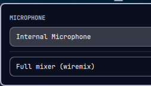

# Microphone input

An [Omarchy](https://omarchy.org) bar widget that switches which microphone
you are actually talking into.

Omarchy's audio panel lists source *nodes*, but a laptop exposes its internal
mic, its headset mic and its jack as **ports on one node**. So the built-in
picker shows a single entry and no real choice, and plugging a headset in does
not change which microphone the call gets. This reaches past the node and
drives the ports directly.



## Install

```bash
omarchy plugin add https://github.com/ignacehelsen/omarchy-mic-input.git --enable
```

Needs `pactl` (libpulse) and `python3`, both of which Omarchy already has, plus
`wiremix` if you want the full mixer button to do anything.

## What it does

- **The panel lists the mic ports** of your default source, with the active one
  marked. Clicking one switches to it.
- **The list re-reads itself** while the panel is open, so plugging a headset in
  shows up without closing and reopening.
- **Ports that are not there** are left out — a jack with nothing in it does not
  clutter the list.
- **Full mixer** opens `wiremix` for everything this panel deliberately does not
  do: levels, per-application routing, outputs.

## Settings

None. The widget follows whatever your default source is.

## The command line

`mic-ports` works on its own:

```
list                one port per line: name, description, 1 if active
set PORT            switch the default source to that port
```

```bash
./mic-ports list
```

## Licence

MIT.
